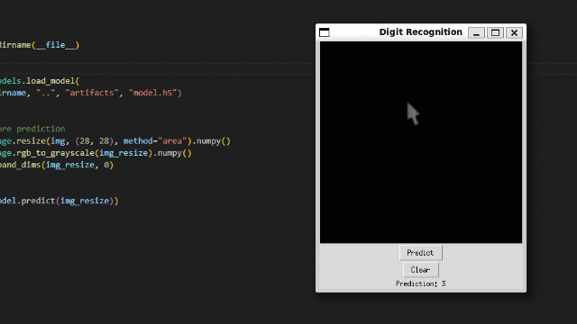

# Handwriten Digit Recognition

In this project I will show you how to implement a Convolutional Neural Network (CNN) usign one of the most traditional datasets for computer vision, the MNIST dataset. The objective here is to create a neural network capable of recognizing handwiten digits.

After that I going to create a simple aplicattion where you can draw a digit and see if the neural network can predict the digit.

## Licensing, Authors, Acknowledgements

LeCun, Yann and Cortes, Corinna and Burges, CJ. MNIST handwritten digit database. ATT Labs [Online]. Available: http://yann.lecun.com/exdb/mnist. Volume 2, 2010.